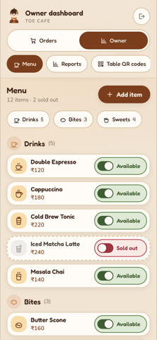

# TOE Cafe — QR ordering

Customers scan a QR code on their table, browse the menu on their own phone, and
place an order with no app to install. Staff see new orders appear live on a
counter phone. The owner edits the menu, sets the tables and reads the monthly
numbers — without a developer.

Built for a 6–10 table cafe on free-tier infrastructure.

<!-- prettier-ignore -->
| | |
|---|---|
| **Live** | <https://toe-cafe.web.app> |
| **Stack** | Next.js 15 (App Router, static export) · TypeScript · Tailwind CSS v4 · Firebase (Firestore + Auth) |
| **Hosting** | Firebase Hosting — free `*.web.app` subdomain, optional custom domain |
| **Live updates** | Firestore `onSnapshot` — no polling loops, no separate realtime service |
| **Install** | Nothing to install. Optional PWA for the staff phone. |
| **Cost** | Free tier. A custom domain is the only expected expense (~₹500–800/year). |
| **Docs** | [Requirements](./docs/requirements.md) · [Theme](./docs/anime-theme.md) · [Decisions](./docs/decisions.md) · [Progress](./docs/progress.md) · [Changelog](./CHANGELOG.md) · [Contributing](./CONTRIBUTING.md) |

### Live deployment

**https://toe-cafe.web.app** — Firebase project `toi-cafe`, Firestore in
`asia-south1`. A project id can't be renamed, so the app is served from a second
Hosting site in that project, `toe-cafe`. The cafe's first address,
<https://toi-cafe.web.app>, now answers every path with a 302 to the same path on
toe-cafe.web.app, query string included, so old bookmarks and any QR card printed
with the old address keep working.

| Screen             | URL                                     | Who                  |
| ------------------ | --------------------------------------- | -------------------- |
| Table picker       | `/`                                     | Customer             |
| Customer menu      | `/order?table=N`                        | Customer             |
| Order confirmation | `/order/confirmation?table=N&id=…`      | Customer             |
| Staff board        | `/staff`                                | Staff and owner      |
| Owner dashboard    | `/admin`, `/admin/reports`, `/admin/qr` | Owner                |
| Offline            | `/offline`                              | Anyone, when offline |

The customer half needs no account. The staff half needs an email and password,
and every account also needs a role record — see
[Create staff and owner accounts](#3-create-staff-and-owner-accounts).

---

## Running the cafe

For the owner and the people at the counter. Nothing here needs a developer
except adding a new barista's account.

- **The counter phone** — open **toe-cafe.web.app/staff** and sign in. New orders appear on their
  own, oldest first, with a wait timer, a chime and a vibration. Browsers only
  allow sound after a tap, so tap the screen once at the start of a shift (the
  board says so until you do). New orders arrive already marked
  _Preparing_; move each one along with its button: _Mark ready → Mark served →
  Complete_. A ticket whose total does not
  match the menu is flagged in red — check it before taking payment.
- **The owner** signs in on the same `/staff` page and goes straight to the owner
  dashboard. An **Orders | Owner** switch at the top moves between the dashboard
  and the order board; baristas never see it.
- **Sold out** — on _Menu_ (`/admin`), each item has an **Available / Sold out**
  switch. One tap, and customers see it immediately.
- **Change an item** — tap its row to open its editor (name, price, description,
  category; Save, Cancel or Delete). **+ Add item** adds a new one, in an existing
  category or a new one. The category chips at the top jump to that section.
- **Today's special** — the line pinned to the top of the customer menu. Edit
  it, flip **Show to customers**, and Save.
- **Tables and QR cards** — on _Table QR codes_ (`/admin/qr`), set the number of
  tables (or type them out, e.g. `1-8, 12`) and save. Customers can only pick, or
  scan into, a table on that list. Then _Print_ one card per table. The cards
  only depend on the address printed on them, so they never need reprinting
  after a menu or price change.
- **Reports** — _Reports_ (`/admin/reports`) shows revenue, order count, average
  order, revenue by day and best sellers for a month or a custom range, with a
  CSV export. Group the CSV by _Order ID_, not _Order #_: order numbers are
  short and repeat (see [below](#order-numbers-are-short-and-not-unique-on-their-own)).
- **"A new version is ready · Reload"** — the app was updated. Tap _Reload_ when
  there is a quiet moment; nothing is lost if you wait.

---

## Quickstart

```bash
git clone https://github.com/shreyashp47/TOE.git
cd TOE
npm ci
npm run dev
```

Open <http://localhost:3000>. That is the whole setup — **no Firebase account
needed.** The app boots in demo mode with a full sample menu and a local storage
backend, and a banner says so.

To see the whole loop, open two tabs:

1. <http://localhost:3000/order?table=3> — the customer's phone
2. <http://localhost:3000/staff> — the staff phone (PIN `1122`)

Place an order in the first tab. It appears in the second **without a refresh**,
and when staff tap _Mark ready_, the customer's status screen updates live.

### Demo sign-ins

| Screen           | Credentials                    |
| ---------------- | ------------------------------ |
| `/staff`         | PIN `1122`                     |
| `/staff`         | `staff@demo.cafe` / `cafe1122` |
| `/staff` (owner) | `owner@demo.cafe` / `cafe1122` |

The owner signs in on `/staff` too, and is taken to `/admin`. Demo data lives in
this browser only. Clearing site data resets it; the owner's menu screen has a
_Reset samples_ button, and _Reports_ can add a sample month of orders.

---

## Screens

Everything below is a real screenshot of the demo build.

<table>
<tr>
<td width="33%"></td>
<td width="33%"></td>
<td width="33%"></td>
</tr>
<tr>
<td align="center"><em>Menu — categories, prices, sold-out state</em></td>
<td align="center"><em>Cart — steppers, live total, consent gate</em></td>
<td align="center"><em>Status — updates live, no refresh</em></td>
</tr>
<tr>
<td width="33%"></td>
<td width="33%"></td>
<td width="33%"></td>
</tr>
<tr>
<td align="center"><em>Staff board — oldest first, wait timer</em></td>
<td align="center"><em>Owner menu — one-tap sold out</em></td>
<td align="center"><em>Reports — revenue, chart, best sellers</em></td>
</tr>
<tr>
<td width="33%"></td>
<td></td>
<td></td>
</tr>
<tr>
<td align="center"><em>QR — set the tables, print a card each</em></td>
<td></td>
<td></td>
</tr>
</table>

### Routes

| Route                              | Who      | What it does                                                      |
| ---------------------------------- | -------- | ----------------------------------------------------------------- |
| `/`                                | Customer | Table picker, for anyone who arrives without a QR code            |
| `/order?table=N`                   | Customer | Menu with category rail, cart bottom sheet, place order           |
| `/order/confirmation?table=N&id=…` | Customer | Order number and live `Received → Preparing → Ready → Served`     |
| `/staff`                           | Staff    | Sign-in, then the live order board with sound + vibration alert   |
| `/admin`                           | Owner    | Menu: sold-out switches, inline editor, add item, today's special |
| `/admin/reports`                   | Owner    | Monthly / custom-range revenue, AOV, best sellers, CSV            |
| `/admin/qr`                        | Owner    | Set the cafe's tables; printable QR tent card per table           |
| `/offline`                         | Anyone   | Service-worker fallback when the wifi drops                       |

---

## Going live with Firebase

The app is designed so this step cannot break the build: no code changes, six
environment variables.

> **For the `toi-cafe` deployment in this repo, sections 1–4 are already done**
> — the project, the database, both sign-in providers, the web app, both Hosting
> sites, the deployed rules, the menu and the owner account. The only thing left
> to repeat is section 3, once for each barista who needs to work the board.

### 1. Create the project

1. [Firebase console](https://console.firebase.google.com) → **Add project** (the
   Spark plan is free).
2. **Build → Firestore Database → Create database.**
   - Start in **production mode** — the rules in this repo are the real ones.
   - Choose a region **near the cafe** (asia-south1 for India).
3. **Build → Authentication → Get started.** Enable **Anonymous** and
   **Email/Password** — both are required, and the reasons are not obvious.
   - **Anonymous** is what lets a customer read their own order back. The rules
     scope reads to `resource.data.customerUid == request.auth.uid`, and without
     it a customer who places an order is shown "we can't find that order" — see
     the note in section 3.
   - **Email/Password** is for staff and owners.
4. **Project settings → Your apps → Web →** copy the six `firebaseConfig` values.

### 2. Point the app at it

```bash
cp .env.example .env.local
```

Fill in the Firebase block:

```ini
NEXT_PUBLIC_FIREBASE_API_KEY=…
NEXT_PUBLIC_FIREBASE_AUTH_DOMAIN=yourcafe.firebaseapp.com
NEXT_PUBLIC_FIREBASE_PROJECT_ID=yourcafe
NEXT_PUBLIC_FIREBASE_STORAGE_BUCKET=yourcafe.appspot.com
NEXT_PUBLIC_FIREBASE_MESSAGING_SENDER_ID=…
NEXT_PUBLIC_FIREBASE_APP_ID=…
```

Optionally brand it and set the default tables:

```ini
NEXT_PUBLIC_CAFE_NAME="TOE Cafe"
NEXT_PUBLIC_TABLES=1,2,3,4,5,6,7,8
NEXT_PUBLIC_BASE_URL=https://yourcafe.web.app
```

`NEXT_PUBLIC_TABLES` is only the starting point. The owner sets the real table
list on `/admin/qr` (_Your tables_: a number of tables, or typed-out numbers such
as `1-8, 12`), which saves it to Firestore at `config/tables`. From then on the
customer's table picker, the check on a scanned table number, and the printed QR
cards all follow the saved list, live, with no rebuild. Until the owner saves one,
the app uses `NEXT_PUBLIC_TABLES` (or tables 1–6 if it is unset). Table numbers
run from 1 to 50, the range the order rules accept.

Restart `npm run dev`. The demo banner disappears and the app talks to Firestore.

> **Why this is safe:** the Firebase SDK is behind a dynamic `import()`, so it is
> never downloaded unless these variables are present. A demo-mode visitor gets a
> ~103 kB first load with no cloud code in it at all.

### 3. Create staff and owner accounts

Every account needs two things: an Email/Password user in Firebase Auth, and a
`/staff/{uid}` document saying what it may do. One command does both:

```bash
firebase login                      # once; the script borrows this login
npm run seed:staff -- --email=you@yourcafe.com --role=owner --name="Cafe Owner"
npm run seed:staff -- --email=asha@yourcafe.com --role=staff --name=Asha
```

For a new account it generates a password and prints it **once** — it is not
saved anywhere, so hand it over there and then (or pass `--password=…` to choose
one). For an existing account it leaves the password alone and only writes the
role, so it is also how you promote a barista to owner or fix a missing role.
Add `--dry-run` to see what it would do without writing anything, and `--help`
for the rest.

How it authenticates, since there is no service-account key in this repo: it
reuses the refresh token that `firebase login` stored in
`~/.config/configstore/firebase-tools.json`, and calls the Auth and Firestore
REST APIs as that Google account — so it must be an owner or editor of the
project. That also means it goes around `firestore.rules`, which is exactly what
creating the first owner needs. (`firebase-admin` was the obvious alternative,
but it wants Application Default Credentials, which means installing gcloud.)
`FIREBASE_TOKEN` from `firebase login:ci` works too, and with
`FIRESTORE_EMULATOR_HOST` and `FIREBASE_AUTH_EMULATOR_HOST` set it talks to the
emulators instead.

What the documents look like, if you would rather use the console
(**Authentication → Users → Add user**, then Firestore):

```json
// /staff/{uid}
{ "name": "Asha", "role": "staff" }
```

**Every account needs a document here, not just owners.** A missing document
means "not staff", and that is deliberate: customers sign in anonymously so the
rules can let each one read back its own order, and a rule that treated "any
signed-in user" as staff would hand the whole order book to everyone who scans a
QR code.

`role` may be `staff` (works the board) or `owner` (also edits the menu, sets
the tables and sees the reports). An account with no document can sign in, but
`/staff` and `/admin` then say _"Your account isn't set up yet — ask the
owner"_ and show its email, user ID and the exact `seed:staff` command to run,
instead of an empty board.

### 4. Add the menu

Sign in as the owner and use **+ Add item** on `/admin`. Each item is a
`/menu/{itemId}` document — `name`, `description`, `price`, `category`,
`available`, `sortOrder` — the same shape as the sample menu in
[`src/lib/data/seed.ts`](./src/lib/data/seed.ts). _Reset samples_ exists in demo
mode only.

### 5. Deploy

The app is a **static export** (`output: "export"` in `next.config.ts`), so it can
be served by Firebase Hosting with no Node runtime. That is safe here: there are
no route handlers, no server actions and no dynamic rendering, so every route
prerenders to plain HTML and every piece of data is fetched in the browser.

**For `toi-cafe`**, from a checkout with the real `.env.local`:

```bash
firebase login
npm run build                                        # emits ./out and stamps out/sw.js
firebase deploy --only firestore:rules,hosting       # rules and both Hosting sites
```

`firebase.json` has two Hosting targets, mapped to sites in `.firebaserc`:
`app` (the `toe-cafe` site, serving `./out`) and `legacy` (the `toi-cafe` site,
which only redirects). `--only hosting` deploys both. Build with
`npm run build`, not a bare `next build`, or the service worker's version is
never stamped and phones keep the old app.

**For your own project**, point the targets at your own site first:

```bash
npm i -g firebase-tools
firebase login
firebase use --add                                   # pick your project
firebase target:apply hosting app <your-site-id>     # usually the project id
```

Then delete the `legacy` entry from the `hosting` list in `firebase.json` (you
have no old address to redirect), build, and `firebase deploy`. You land on
`https://<your-site-id>.web.app`. `firebase.json` sets `cleanUrls`, so `/order`
is served from `out/order.html` and the printed QR URLs work unchanged.

**Deploy the rules too — this is the part people skip.** Without them,
Firestore's default "test mode" rules leave the database readable and writable
by anyone with the project id. The rules in this repo are what make the
requirements' §6 security clause true: the public can read the menu and the
cafe's settings, **create** an order (with its throttle stamp) and read back its
own order — nothing else. See the comments in
[`firestore.rules`](./firestore.rules) for each clause.

To attach a custom domain later, add it under **Hosting → Add custom domain**. The
QR codes do not need regenerating as long as `/order?table=N` keeps working, which
is why `NEXT_PUBLIC_BASE_URL` exists if you want to print cards against a staging
address first.

#### Automatic deploys from `main` (not switched on yet)

`.github/workflows/deploy.yml` is written to deploy every push to `main` that
passes the whole CI workflow: it builds that exact commit, deploys rules and
hosting in one command, then checks that `https://toe-cafe.web.app/sw.js`
carries the new build's cache version. A push that fails CI never deploys; if an
older commit's CI finishes after a newer one's, the older one is skipped rather
than rolling the site back; _Run workflow_ redeploys `main` by hand.

**It does not deploy anything yet.** The repository secret and variables below
have not been set, so the workflow stops at _Check the Firebase config is set_,
and `toi-cafe` is still deployed by hand as above. To switch it on, set up once:

1. **A service account key**, as the secret `FIREBASE_SERVICE_ACCOUNT`. In the
   Google Cloud console for the project, go to _IAM & Admin → Service accounts_
   and create `github-deploy` with the roles _Firebase Hosting Admin_,
   _Firebase Rules Admin_, _Service Usage Consumer_ and _Cloud Datastore
   Viewer_. Then go to _Keys → Add key → JSON_ and run:

   ```bash
   gh secret set FIREBASE_SERVICE_ACCOUNT < ~/Downloads/toi-cafe-*.json
   rm ~/Downloads/toi-cafe-*.json      # GitHub has it now; don't keep a copy
   ```

   Treat the key as the keys to the order book: whoever holds it can rewrite the
   rules. Rotate it by creating a new key, setting the secret again and deleting
   the old key in the console.

2. **The `NEXT_PUBLIC_*` values**, as repository variables, from the same
   `.env.local` the local build uses. They are public, which is why they are
   variables and not secrets:

   ```bash
   gh variable set -f .env.local
   ```

   If any of the six Firebase values or `NEXT_PUBLIC_BASE_URL` is missing, the
   deploy stops before building. Otherwise the site
   would quietly fall back to demo mode.

#### Check the live site, not just the deploy output

`firebase deploy` reporting success does not mean the app works — a rule that
refuses a read, or a query missing an index, both fail silently at the browser.
Drive the real thing:

```bash
BASE_URL=https://toe-cafe.web.app npm run test:entry   # every way a customer reaches the menu
BASE_URL=https://toe-cafe.web.app npm run audit         # contrast + WebKit, both engines
```

`npm run audit` is this project's script, not npm's built-in `npm audit`; the
`run` matters. Against a live site it checks the staff and owner screens as a
signed-out visitor would see them. `npm run flow` is not in this list on
purpose: it signs in with the demo PIN, so it only works in demo mode, and
pointed at a live site it would place a real order.

`test:entry` is the one that catches the class of bug that hides best. Tapping a
table number is a client-side navigation, so a hook that reads the query string
once on mount will look correct for every scanned QR code and wrong for every
tap. Both used to end on the same URL and show different screens.

To confirm the database side:

```bash
npm run emulators    # terminal 1
npm run test:rules   # terminal 2 — 81 checks, 0 failures
```

To check the routing and header rules from `firebase.json` before a deploy, with
no account needed, run `npm run build` and then
`firebase emulators:start --only hosting`, and check that `/`, `/order?table=3`,
`/staff`, `/admin/reports` and `/sw.js` return 200 and that a 404 still returns 404.

#### Updating a phone that already has the app

Every `npm run build` writes a hash of the exported site into `out/sw.js` as its
cache version (`scripts/stamp-sw.mjs`). A new deploy is therefore a new service
worker: phones pick it up on their next page load, and an open page also checks
hourly and whenever the tab comes back into view. The new worker takes over
straight away and deletes the previous build's caches.

It does **not** reload the page by itself. A reload on the counter phone would
silently switch the order sound off (browsers need a tap before they play audio)
and could land mid-tap, so the page shows _"A new version is ready · Reload"_ and
the barista chooses when.

> **The headers are declared twice, on purpose.** `next.config.ts` has the
> `headers()` block for `next start`, and `firebase.json` re-declares the
> security headers, because Next _silently discards_ `headers()` when exporting.
> It prints a warning during the build but ships the site without them. If you
> change a security header in one place, change it in both. `firebase.json` also
> sets the caching: hashed `/_next/static/**` files are kept for a year, while
> pages, their `.txt` router data and `/sw.js` are revalidated on every load — a
> page and its router data cached from different deploys once sent the owner to
> raw text at `/admin.txt`.

> **Upgrading from before 0.2.0?** That release changed the shape of an order
> write, so rules and hosting must go out in one command and open pages need a
> reload. The steps are in [CHANGELOG 0.2.0](./CHANGELOG.md#020--2026-09-28).
> A leftover `meta/counters` document is inert; delete it whenever you like.

<details>
<summary>Vercel instead (one-line alternative)</summary>

Push the repo, import it at [vercel.com/new](https://vercel.com/new), and add the
same six `NEXT_PUBLIC_FIREBASE_*` values under **Settings → Environment Variables**
for all three environments. Vercel runs the Next.js runtime, so it honours
`headers()` directly and `output: "export"` is simply ignored. Note that
`NEXT_PUBLIC_*` values are baked in at build time, so editing one later needs a
redeploy, not just a restart.

</details>

### Old orders

Nothing deletes orders automatically: the requirement is to keep _at least_ six
months, and a Firestore TTL policy that would enforce a ceiling needs the Blaze
plan. When you want to clear old ones out:

```bash
npm run cleanup:orders                                   # dry run: how many are over 6 months old
npm run cleanup:orders -- --older-than=1y --confirm      # delete orders over a year old
```

It only deletes with `--confirm`, refuses anything under six months, and uses the
same `firebase login` as `seed:staff`. Deleted orders disappear from
`/admin/reports` too, so export those months as CSV first. The reasoning is in
[`docs/decisions.md`](./docs/decisions.md#order-retention-is-an-operational-practice-not-a-feature).

---

## Troubleshooting

### "A tree hydrated but some attributes of the server rendered HTML didn't match"

Look at the attributes in the error before changing any code. If you see
`data-gr-ext-installed` or `data-new-gr-c-s-check-loaded`, that is **Grammarly**,
not this app. Writing extensions stamp helper attributes onto `<body>` before
React hydrates, and React cannot patch attributes it did not render.

It only ever appears in `npm run dev`, as a red overlay. A production build with
the same extension installed serves the page with no error at all.

Turn the extension off for `localhost` (Grammarly → Settings → More Settings →
Application exclusions) or use a private window. No code change is needed, and
none should be made: suppressing it would also hide genuine server/client
mismatches, which are worth seeing.

### If the build fails with "An error occurred in `next/font`"

`next/font/google` downloads the font files from Google **at build time**. On a
flaky connection it fails with an unhelpful `TypeError: Cannot read properties of
null` from the font loader, which looks like a code bug but is not one.

Just build again — it caches after the first success. CI already retries once
automatically.

If you are deploying from somewhere with unreliable internet, self-host the fonts
instead: download the woff2 files for Caveat (600, 700), Fredoka (500, 600) and
Nunito (400, 600, 700) into `public/fonts`, and swap the three `next/font/google`
calls in `src/app/layout.tsx` for `next/font/local`. The CSS variables and every
component stay exactly as they are — nothing else in the app knows which loader
produced the font.

---

## What the rules cannot do

Worth reading before you rely on the money figures.

`firestore.rules` is a real boundary, not a formality: `scripts/rules-test.mjs`
runs 81 checks against the emulators covering the anonymous customer, a
signed-out caller, a signed-in barista and a signed-in owner. A barista cannot
edit the menu, cannot read another barista's role record, cannot skip a status
and cannot change a price after the order is placed.

But the rules language has **no loops and no lambdas** — there is no `reduce` and
no `function` expression. So a rule cannot sum a variable-length basket, which
means:

- `status`, `createdAt`, the field set and the shape of every line **are** enforced
  server-side.
- The `total` is **not**. It is checked to be a bounded integer, not to be correct.
  A customer with devtools could post `total: 1` for a real basket and it would be
  accepted.

What the app does about it, on the free tier, is **detection, not prevention**.
The staff board re-derives every ticket — the stored total against its own
lines, and each line's price and name against the live menu — and a ticket that
does not match gets a red _"Total doesn't match menu — check before charging"_
box, the stored figure struck through, and the basket's price at today's menu
next to it. So a doctored order still lands in the database, but it cannot get
past the counter unnoticed, which is where the money is actually taken.
`/admin/reports` already sums revenue from the line items rather than the stored
totals, and lists any order in the period whose total disagrees with its items,
so the owner can reconcile it against the till.

Two honest caveats. A line's price is copied from the menu when the order is
placed, so if the owner changes a price while an order is on the board, that
ticket is flagged too; the box names both prices so the barista can tell. And
this only works because a human looks at the board before taking payment — if
payment ever moves online, detection is not enough.

The real fix is a Firestore-triggered function that rewrites `total` from the
stored lines and the menu. That requires the Blaze plan (Cloud Functions 2nd gen
includes 2M invocations a month free — far more than a cafe uses), and it stays
the documented follow-up.

**Order volume is limited per customer, not per device.** Placing an order is the
one write the public can make, so the rules throttle it: each customer's anonymous
uid gets an `/orderThrottle/{uid}` document, every order must be written in the
same batch as a fresh stamp on it, and the stamp is refused until **30 seconds**
after the previous one. A second order a minute later goes through; a double tap
gets a plain "you can send another in 25 seconds" on the phone before anything is
sent. A script looping on one uid gets two orders a minute.

What it does not stop is a script that signs in anonymously again for every
order, because each new uid starts with a clean clock. Firebase Auth rate-limits
new account creation per IP address, which slows that down, but the real answer
is **App Check**, and App Check needs the Blaze plan. It is the next step if the
board ever fills with junk; nothing in the throttle needs to change to add it.
The number lives in two places — `firestore.rules` and `ORDER_GAP_SECONDS` in
[`src/lib/order-throttle.ts`](./src/lib/order-throttle.ts) — and a unit test
fails if they disagree.

---

## How it works

```
Customer phone                     Counter phone                  Owner
──────────────                     ─────────────                  ─────
scan /order?table=3 ──┐
                      │   ┌── onSnapshot(status != completed)
browse menu           │   │         │
add to cart (per      │   │    staff board
 table, survives      │   │      │  tap: Preparing → Ready → Served → Completed
 a reload)            │   │      │
place order ──────────┴───┴──────┘
   │
   └── onSnapshot(own order) ── live status on the customer's screen
```

| Concern             | Where it lives                                             |
| ------------------- | ---------------------------------------------------------- |
| Storage contracts   | [`src/lib/data/types.ts`](./src/lib/data/types.ts)         |
| Firestore adapter   | [`src/lib/data/firestore.ts`](./src/lib/data/firestore.ts) |
| Demo adapter        | [`src/lib/data/`](./src/lib/data)                          |
| Status machine      | [`src/lib/order-status.ts`](./src/lib/order-status.ts)     |
| Money + order maths | [`src/lib/money.ts`](./src/lib/money.ts)                   |
| Cart reducer        | [`src/lib/cart.ts`](./src/lib/cart.ts)                     |
| Report aggregation  | [`src/lib/reports.ts`](./src/lib/reports.ts)               |
| Table list          | [`src/lib/tables.ts`](./src/lib/tables.ts)                 |
| QR encoder          | [`src/lib/qr.ts`](./src/lib/qr.ts)                         |
| Theme tokens        | [`src/app/globals.css`](./src/app/globals.css)             |
| Mascot + icons      | [`src/components/`](./src/components)                      |
| Security rules      | [`firestore.rules`](./firestore.rules)                     |

Two rules worth knowing before you change anything:

1. **Never hardcode a colour.** The palette is locked by
   [`docs/anime-theme.md`](./docs/anime-theme.md) §2 and lives in CSS variables.
   Add a token; don't add a hex to a component.
2. **Money is only partly server-checked, and you should know where the gap is.**
   The total is client-supplied; the staff board flags a total that does not
   match the menu, but that is detection, not prevention. See
   [What the rules cannot do](#what-the-rules-cannot-do) before you rely on it.

### Order numbers are short, and not unique on their own

The `#417` on the staff board and the customer's screen is derived from the
order's document id ([`src/lib/order-number.ts`](./src/lib/order-number.ts)), not
allocated from a counter. It is three digits because a barista reads it out, and
it is always shown next to the table, which is what actually tells two orders
apart. Two orders in a day can share a number; two open orders on the same table
sharing one is about a 1-in-900 chance per pair. Across a busy board the odds that
_some_ two orders share a number are much higher — about 19% with 20 open — so
read the table first.

It used to come from a `/meta/counters` document that every customer phone
incremented, which meant anyone could reset it or run it up. Nothing writes
`/meta` now, and the rules deny it to everyone. Orders placed under the old
counter keep their stored number.

---

## Quality gates

```bash
npm run verify     # lint → typecheck → test → build
```

| Command                  | What it does                                                 |
| ------------------------ | ------------------------------------------------------------ |
| `npm run dev`            | Dev server                                                   |
| `npm run build`          | Static export to `./out`, then stamps the `sw.js` version    |
| `npm run preview`        | Serve `./out` on port 4320, with clean URLs as Firebase does |
| `npm run lint`           | ESLint 9, `next/core-web-vitals` + TypeScript rules          |
| `npm run typecheck`      | `tsc --noEmit`, `strict`                                     |
| `npm test`               | Vitest + Testing Library, 423 tests in 28 files              |
| `npm run test:coverage`  | Coverage, fails below 70% on all four metrics                |
| `npm run test:rules`     | Attack `firestore.rules` (needs `npm run emulators`)         |
| `npm run test:entry`     | Every way a customer reaches the menu, in a real browser     |
| `npm run flow`           | Customer → staff → customer, end to end (demo mode only)     |
| `npm run audit`          | WCAG A/AA in Chromium and WebKit (not `npm audit`)           |
| `npm run seed:staff`     | Create a staff/owner account and its role document           |
| `npm run cleanup:orders` | Count (or with `--confirm`, delete) orders over 6 months old |
| `npm run format`         | Prettier, incl. Tailwind class sorting                       |

The browser scripts check what a unit test cannot. Each starts `next dev` itself,
or uses `BASE_URL` if set — for example against `npm run build && npm run preview`
with `BASE_URL=http://127.0.0.1:4320`:

```bash
node scripts/screenshot.mjs            # every screen at 320/390/430/768/1280 px
npm run audit                          # WCAG A/AA + WebKit (Safari/iOS)
npm run audit -- --engine=webkit       # WebKit only
npm run flow                           # customer → staff → customer, end to end
```

`npm run flow` needs demo mode: it signs staff in with the demo PIN, and the dev
server it starts reads `.env.local`, so with Firebase keys there it would talk to
the real project. Move `.env.local` aside (or run in a checkout without one)
first.

- **`screenshot.mjs`** fails on any console error **and** on horizontal overflow
  at any width — the failure mode that actually matters on a phone.
- **`audit.mjs`** runs every screen through axe-core at an iPhone viewport, in
  **both Chromium and WebKit**. WebKit is Safari/iOS, which is a large share of
  cafe customers, so it is the only way to actually verify the "works on
  standard Android/iOS browsers" claim. It is also what caught that two colours in
  the locked palette cannot legally carry body text — see below.
- **`flow.mjs`** places a real order and asserts the staff board sees it and the
  customer's screen tracks the status changes.

CI (`.github/workflows/ci.yml`) runs lint, typecheck, tests and the build on
every push and pull request, and the rules attack against the emulators. On
`main` it also runs the browser checks and a `self-check` job that deliberately
breaks the money calculation and fails if the suite stays green. A test suite
nobody has seen go red is not a quality gate.

### What the tests cover

- **Money maths** — totals from many lines, integer-only arithmetic,
  re-pricing against a live menu, refusal of a tampered total.
- **Status machine** — every legal hop, and that skipping or reversing is
  refused.
- **Reports** — revenue/orders/AOV reconciliation, top-seller ranking, share
  sums, per-day buckets, half-open range boundaries (so months never double
  count), year roll-over, CSV escaping.
- **QR encoder** — round-tripped through a real decoder for every plausible table
  URL, plus finder-pattern and quiet-zone structure checks.
- **Storage contract** — the behaviours both backends must satisfy, asserted
  against the demo store: live emission, ordering, no deletes, bounded ranges.
- **UI** — cart stepper maths, sold-out items, staff status buttons, sheet
  dialog semantics, accessible labelling.

### A note on the palette and contrast

`docs/anime-theme.md` §2 locks the palette, and three of those colours are
mid-tones that cannot legally carry body text on a light background:

| Colour               | On         | Ratio | AA needs |
| -------------------- | ---------- | ----- | -------- |
| terracotta `#C97B3D` | cream text | 2.9:1 | 4.5:1    |
| sage `#6B8E5A`       | pale sage  | 3.0:1 | 4.5:1    |
| berry `#C0505B`      | paper      | 4.4:1 | 4.5:1    |

Rather than change the locked hues, the theme keeps them for their documented
purpose — icons, chart bars, borders, category accents — and adds
`--secondary-deep`, `--sage-deep` and `--berry-deep`: the same hues darkened just
enough to carry text. `scripts/audit.mjs` is the gate that keeps this true, and
it runs in CI.

---

## Design

Warm cream café palette, locked in [`docs/anime-theme.md`](./docs/anime-theme.md) §2
and implemented as CSS variables. Three font families, only the weights actually
used, self-hosted via `next/font` so there is no render-blocking Google request.

The mascot is **original** — a hand-authored chibi barista, not any existing
anime character, as the theme doc requires. She appears on the loading state, the
empty states, the order confirmation and the sign-in gate, and the same markup
generates the PWA icon set.

Accessibility and mobile ergonomics are not afterthoughts:

- every touch target is at least 44×44px
- verified at 320 / 390 / 430 / 768 / 1280 px with no horizontal scroll
- `prefers-reduced-motion` disables every animation
- prices and item names stay in a plain sans-serif; the handwritten font is
  decorative only
- the cart sheet is a real modal dialog (Escape, focus, backdrop)
- on/off settings are real switches (`role="switch"`) with a visible label
- status changes are announced via `aria-live`

---

## Roadmap

Delivered in this repository: customer ordering, live staff board, menu
management, owner-set tables, reporting, QR generation, PWA, security rules,
tests, CI. What is in flight is in [docs/progress.md](./docs/progress.md).

Not built, and the requirements already scope it out:

- **Payments.** Pay-at-counter for v1. `paymentMethod` is on the order document
  so adding UPI is a UI change, not a migration.
- **Background push.** FCM/Web Push for when the staff phone is locked — needs
  VAPID keys, and a real device to be worth testing on.
- **Scheduled monthly reports** by email/PDF. The aggregation is already a pure
  function, so this is a scheduled job calling `buildReport()`.
- **Customer accounts** and order history. The per-table localStorage session
  covers the honest v1 case (one phone, one table, one visit).

---

## Licence

MIT — see [LICENSE](./LICENSE). The mascot, icons and illustrations in this repo
are original work created for this project; no anime or manga IP is used or
referenced.
