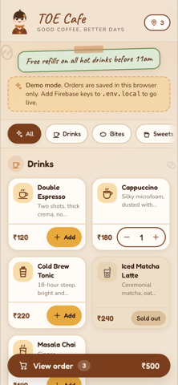
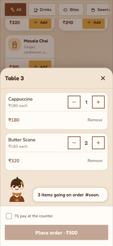
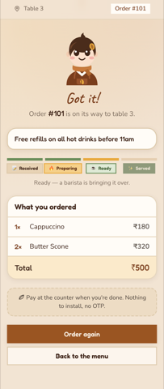
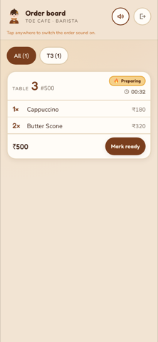
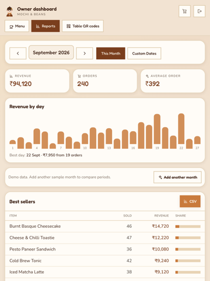
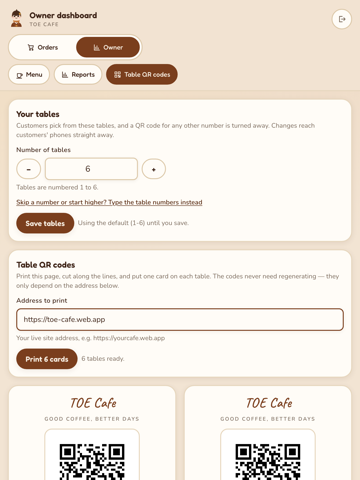

# Cafe QR Ordering System

Customers scan a QR code on their table, browse the menu on their own phone, and
place an order with no app to install. Staff see new orders appear live on a
counter phone. The owner edits the menu and reads the monthly numbers — without a
developer.

Built for a 6–10 table cafe on free-tier infrastructure.

<!-- prettier-ignore -->
| | |
|---|---|
| **Stack** | Next.js 15 (App Router) · TypeScript · Tailwind CSS v4 · Firebase (Firestore + Auth) |
| **Hosting** | Firebase Hosting — free `*.web.app` subdomain, optional custom domain |
| **Live updates** | Firestore `onSnapshot` — no polling loops, no separate realtime service |
| **Install** | Nothing to install. Optional PWA for the staff phone. |
| **Cost** | Free tier. A custom domain is the only expected expense (~₹500–800/year). |
| **Docs** | [Requirements](./docs/requirements.md) · [Theme](./docs/anime-theme.md) · [Decisions](./docs/decisions.md) |

---

## Quickstart

```bash
git clone https://github.com/shreyashp47/TOE.git
cd TOE
npm ci
npm run dev
```

Open <http://localhost:3000>. That is the whole setup — **no Firebase account
needed.** The app boots in demo mode with a full sample menu and a local storage
backend, and a banner says so.

To see the whole loop, open two tabs:

1. <http://localhost:3000/order?table=3> — the customer's phone
2. <http://localhost:3000/staff> — the staff phone (PIN `1122`)

Place an order in the first tab. It appears in the second **without a refresh**,
and when staff tap _Mark ready_, the customer's status screen updates live.

### Demo sign-ins

| Screen           | Credentials                    |
| ---------------- | ------------------------------ |
| `/staff`         | PIN `1122`                     |
| `/staff`         | `staff@demo.cafe` / `cafe1122` |
| `/admin` (owner) | `owner@demo.cafe` / `cafe1122` |

Demo data lives in this browser only. Clearing site data resets it; the owner
screen has a _Reset samples_ button.

---

## Screens

Everything below is a real screenshot at phone width, from the demo build.

<table>
<tr>
<td width="33%"></td>
<td width="33%"></td>
<td width="33%"></td>
</tr>
<tr>
<td align="center"><em>Menu — categories, prices, sold-out state</em></td>
<td align="center"><em>Cart — steppers, live total, consent gate</em></td>
<td align="center"><em>Status — updates live, no refresh</em></td>
</tr>
<tr>
<td width="33%"></td>
<td width="33%"></td>
<td width="33%"></td>
</tr>
<tr>
<td align="center"><em>Staff board — oldest first, wait timer</em></td>
<td align="center"><em>Reports — revenue, chart, best sellers</em></td>
<td align="center"><em>QR — one printable card per table</em></td>
</tr>
</table>

### Routes

| Route                              | Who      | What it does                                                  |
| ---------------------------------- | -------- | ------------------------------------------------------------- |
| `/order?table=N`                   | Customer | Menu with category rail, cart bottom sheet, place order       |
| `/order/confirmation?table=N&id=…` | Customer | Order number and live `Received → Preparing → Ready → Served` |
| `/staff`                           | Staff    | Live order board, status actions, sound + vibration alert     |
| `/admin`                           | Owner    | Menu management, availability toggles, today's special        |
| `/admin/reports`                   | Owner    | Monthly / custom-range revenue, AOV, best sellers, CSV        |
| `/admin/qr`                        | Owner    | Printable QR tent card per table                              |
| `/offline`                         | Anyone   | Service-worker fallback when the wifi drops                   |

---

## Going live with Firebase

The app is designed so this step cannot break the build: no code changes, six
environment variables.

### 1. Create the project

1. [Firebase console](https://console.firebase.google.com) → **Add project** (the
   Spark plan is free).
2. **Build → Firestore Database → Create database.**
   - Start in **production mode** — the rules in this repo are the real ones.
   - Choose a region **near the cafe** (asia-south1 for India).
3. **Build → Authentication → Get started → Email/Password.**
4. **Project settings → Your apps → Web →** copy the six `firebaseConfig` values.

### 2. Point the app at it

```bash
cp .env.example .env.local
```

Fill in the Firebase block:

```ini
NEXT_PUBLIC_FIREBASE_API_KEY=…
NEXT_PUBLIC_FIREBASE_AUTH_DOMAIN=yourcafe.firebaseapp.com
NEXT_PUBLIC_FIREBASE_PROJECT_ID=yourcafe
NEXT_PUBLIC_FIREBASE_STORAGE_BUCKET=yourcafe.appspot.com
NEXT_PUBLIC_FIREBASE_MESSAGING_SENDER_ID=…
NEXT_PUBLIC_FIREBASE_APP_ID=…
```

Optionally brand it and pin the tables:

```ini
NEXT_PUBLIC_CAFE_NAME="Mochi & Beans"
NEXT_PUBLIC_TABLES=1,2,3,4,5,6,7,8
NEXT_PUBLIC_BASE_URL=https://yourcafe.web.app
```

Restart `npm run dev`. The demo banner disappears and the app talks to Firestore.

> **Why this is safe:** the Firebase SDK is behind a dynamic `import()`, so it is
> never downloaded unless these variables are present. A demo-mode visitor gets a
> ~103 kB first load with no cloud code in it at all.

### 3. Create staff and owner accounts

Authentication is email + password, so make the accounts first. The quickest
route is a temporary sign-up screen or the Firebase console
(**Authentication → Users → Add user**).

Then give the owner their role, which is what `firestore.rules` checks:

```json
// /staff/{uid}
{ "name": "Cafe Owner", "role": "owner" }
```

Any user without that document is treated as `staff` — a barista can work the
board but cannot touch the menu or the reports. A missing document is a safe
default, not a lockout.

### 4. Seed the menu

Create your first item in `/admin`, or add a temporary seeding snippet in
`src/lib/data/seed.ts` to the Firestore path. The sample menu's structure —
`name`, `description`, `price`, `category`, `available`, `sortOrder` — is exactly
the `/menu/{itemId}` document from the requirements.

### 5. Deploy

```bash
npm i -g firebase-tools
firebase login
firebase init hosting    # public dir: dist, single-page app: No
```

```bash
npm run build
firebase deploy --only hosting,firestore:rules,firestore:indexes
```

You land on `https://<project-id>.web.app`. To attach a custom domain later, add
it under **Hosting → Add custom domain** — the QR codes do not need regenerating
as long as `/order?table=N` keeps working, which is why `NEXT_PUBLIC_BASE_URL`
exists if you want to print cards against a staging address first.

### If the build fails with "An error occurred in `next/font`"

`next/font/google` downloads the font files from Google **at build time**. On a
flaky connection it fails with an unhelpful `TypeError: Cannot read properties of
null` from the font loader, which looks like a code bug but is not one.

Just build again — it caches after the first success. CI already retries once
automatically.

If you are deploying from somewhere with unreliable internet, self-host the fonts
instead: download the woff2 files for Caveat (600, 700), Fredoka (500, 600) and
Nunito (400, 600, 700) into `public/fonts`, and swap the three `next/font/google`
calls in `src/app/layout.tsx` for `next/font/local`. The CSS variables and every
component stay exactly as they are — nothing else in the app knows which loader
produced the font.

### Deploy the rules too — this is the part people skip

```bash
firebase deploy --only firestore:rules,firestore:indexes
```

Without this, Firestore's default "test mode" rules leave the database readable
and writable by anyone with the project id. The rules in this repo are what make
§6's security requirement true: the public can **create** orders and **read** the
menu, and nothing else. See the comments in [`firestore.rules`](./firestore.rules)
for each clause.

---

## How it works

```
Customer phone                     Counter phone                  Owner
──────────────                     ─────────────                  ─────
scan /order?table=3 ──┐
                      │   ┌── onSnapshot(status != completed)
browse menu           │   │         │
add to cart (per      │   │    staff board
 table, survives      │   │      │  tap: Preparing → Ready → Served → Completed
 a reload)            │   │      │
place order ──────────┴───┴──────┘
   │
   └── onSnapshot(own order) ── live status on the customer's screen
```

| Concern             | Where it lives                                             |
| ------------------- | ---------------------------------------------------------- |
| Storage contracts   | [`src/lib/data/types.ts`](./src/lib/data/types.ts)         |
| Firestore adapter   | [`src/lib/data/firestore.ts`](./src/lib/data/firestore.ts) |
| Demo adapter        | [`src/lib/data/`](./src/lib/data)                          |
| Status machine      | [`src/lib/order-status.ts`](./src/lib/order-status.ts)     |
| Money + order maths | [`src/lib/money.ts`](./src/lib/money.ts)                   |
| Cart reducer        | [`src/lib/cart.ts`](./src/lib/cart.ts)                     |
| Report aggregation  | [`src/lib/reports.ts`](./src/lib/reports.ts)               |
| QR encoder          | [`src/lib/qr.ts`](./src/lib/qr.ts)                         |
| Theme tokens        | [`src/app/globals.css`](./src/app/globals.css)             |
| Mascot + icons      | [`src/components/`](./src/components)                      |
| Security rules      | [`firestore.rules`](./firestore.rules)                     |

Two rules worth knowing before you change anything:

1. **Never hardcode a colour.** The palette is locked by
   [`docs/anime-theme.md`](./docs/anime-theme.md) §2 and lives in CSS variables.
   Add a token; don't add a hex to a component.
2. **Never trust the client for money.** Totals are recomputed from line items,
   in the app _and_ in the security rules.

---

## Quality gates

```bash
npm run verify     # lint → typecheck → test → build
```

| Command                 | What it does                                        |
| ----------------------- | --------------------------------------------------- |
| `npm run dev`           | Dev server                                          |
| `npm run lint`          | ESLint 9, `next/core-web-vitals` + TypeScript rules |
| `npm run typecheck`     | `tsc --noEmit`, `strict`                            |
| `npm test`              | Vitest + Testing Library, 189 tests                 |
| `npm run test:coverage` | Coverage, fails below 70% on all four metrics       |
| `npm run build`         | Production build                                    |
| `npm run format`        | Prettier, incl. Tailwind class sorting              |

There are also three Playwright scripts for checking things a unit test cannot:

```bash
node scripts/screenshot.mjs            # every screen at 320/390/430/768/1280 px
node scripts/audit.mjs                 # WCAG A/AA + WebKit (Safari/iOS)
node scripts/flow.mjs                  # customer → staff → customer, end to end
```

- **`screenshot.mjs`** fails on any console error **and** on horizontal overflow
  at any width — the failure mode that actually matters on a phone.
- **`audit.mjs`** runs every screen through axe-core at an iPhone viewport, in
  **both Chromium and WebKit**. WebKit is Safari/iOS, which is a large share of
  cafe customers, so it is the only way to actually verify the "works on
  standard Android/iOS browsers" claim. It is also what caught that two colours in
  the locked palette cannot legally carry body text — see below.
- **`flow.mjs`** places a real order and asserts the staff board sees it and the
  customer's screen tracks the status changes.

### What the tests cover

- **Money maths** — totals from many lines, integer-only arithmetic,
  re-pricing against a live menu, refusal of a tampered total.
- **Status machine** — every legal hop, and that skipping or reversing is
  refused.
- **Reports** — revenue/orders/AOV reconciliation, top-seller ranking, share
  sums, per-day buckets, half-open range boundaries (so months never double
  count), year roll-over, CSV escaping.
- **QR encoder** — round-tripped through a real decoder for every plausible table
  URL, plus finder-pattern and quiet-zone structure checks.
- **Storage contract** — the behaviours both backends must satisfy, asserted
  against the demo store: live emission, ordering, no deletes, bounded ranges.
- **UI** — cart stepper maths, sold-out items, staff status buttons, sheet
  dialog semantics, accessible labelling.

### A note on the palette and contrast

`docs/anime-theme.md` §2 locks the palette, and three of those colours are
mid-tones that cannot legally carry body text on a light background:

| Colour               | On         | Ratio | AA needs |
| -------------------- | ---------- | ----- | -------- |
| terracotta `#C97B3D` | cream text | 2.9:1 | 4.5:1    |
| sage `#6B8E5A`       | pale sage  | 3.0:1 | 4.5:1    |
| berry `#C0505B`      | paper      | 4.4:1 | 4.5:1    |

Rather than change the locked hues, the theme keeps them for their documented
purpose — icons, chart bars, borders, category accents — and adds
`--secondary-deep`, `--sage-deep` and `--berry-deep`: the same hues darkened just
enough to carry text. `scripts/audit.mjs` is the gate that keeps this true, and
it runs in CI.

The `self-check` CI job deliberately breaks the money calculation on `main` and
fails if the suite stays green. A test suite nobody has seen go red is not a
quality gate.

---

## Design

Warm cream café palette, locked in [`docs/anime-theme.md`](./docs/anime-theme.md) §2
and implemented as CSS variables. Three font families, only the weights actually
used, self-hosted via `next/font` so there is no render-blocking Google request.

The mascot is **original** — a hand-authored chibi barista, not any existing
anime character, as the theme doc requires. She appears on the loading state, the
empty states, the order confirmation and the sign-in gate, and the same markup
generates the PWA icon set.

Accessibility and mobile ergonomics are not afterthoughts:

- every touch target is at least 44×44px
- verified at 320 / 390 / 430 / 768 / 1280 px with no horizontal scroll
- `prefers-reduced-motion` disables every animation
- prices and item names stay in a plain sans-serif; the handwritten font is
  decorative only
- the cart sheet is a real modal dialog (Escape, focus, backdrop)
- status changes are announced via `aria-live`

---

## Roadmap

Delivered in this repository: customer ordering, live staff board, menu
management, reporting, QR generation, PWA, security rules, tests, CI.

Not built, and the requirements already scope it out:

- **Payments.** Pay-at-counter for v1. `paymentMethod` is on the order document
  so adding UPI is a UI change, not a migration.
- **Background push.** FCM/Web Push for when the staff phone is locked — needs a
  service worker + VAPID keys, and a real device to be worth testing on.
- **Scheduled monthly reports** by email/PDF. The aggregation is already a pure
  function, so this is a scheduled job calling `buildReport()`.
- **Customer accounts** and order history. The per-table localStorage session
  covers the honest v1 case (one phone, one table, one visit).

---

## Licence

MIT — see [LICENSE](./LICENSE). The mascot, icons and illustrations in this repo
are original work created for this project; no anime or manga IP is used or
referenced.
